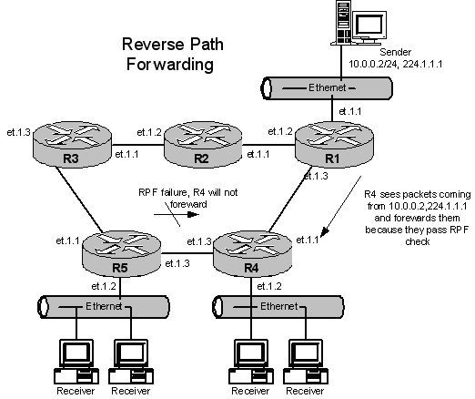
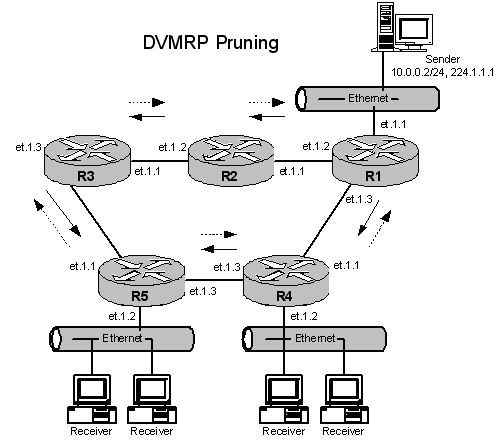
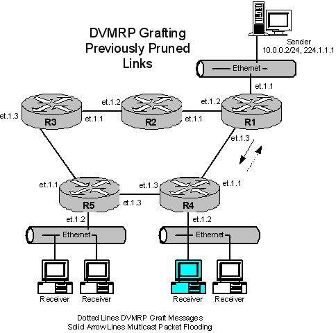

DVMRP Overview
==============

Reverse Path Forwarding
-----------------------

DVMRP uses Reverse Path Forwarding[^1] (RPF) to determine the best
(shortest) path back to the source.  The router examines all packets
received as input to make sure that both source address and interface
are in the routing table.  It looks up the source address in the
forwarding table[^2] and compares that entry with the receiving entry
(RFP check).  If the interface and entry do not match or are not in the
table, then the packets are discarded.  If there is a match, then the
router forwards the packets.

 
Flood & Prune
-------------

Periodically, the source performs what is known as flooding in order to
push datagrams downstream.  Initially, DVMRP routers assume that every
node on the connected subnets wants to receive data.  Along with the
datagrams, a packet called the *route report* is transmitted (across a
time interval).  All the routes known by a given router is sent to all
adjacent routers.  By using IGMP[^3], the routers are aware of which
hosts are connected to the subnets.  On receiving the *route reports*, a
router selects the best adjacent router through which it can reach the
given source network.

After registering that router as the *upstream neighbor*, a *dependency*
is expressed to the router for receiving packets.  Upon receiving this
*dependency*, the receiving router registers the expressed *dependency*
as its *dependent downstream neighbor*.

Hence, an optimal multicast spanning tree is constructed.  On receiving
a multicast packet, a router accepts that packet for forwarding if and
only if the packet is received from the UPSTREAM NEIGHBOR.  Otherwise,
it will be dropped.

Then, the list of the *dependent downstream neighbor* is verified and
the Lower Layer protocols forwards the packets to the specific
neighbors.  If there are no *dependent downstream neighbors*, *prune
messages* are sent to the *upstream neighbor*, requesting that the
router should stop sending packets from the specified source network for
a specified amount of time.

Thus, datagrams will no longer be transmitted along that path (cutting
down on the bandwidth being used).  After a prune interval, packets will
be flooded downstream again, along the shortest path trees.

If any other routers expresses some dependencies, *graft messages* are
sent to that *upstream neighbor*.  Upon receiving an acknowledgment,
*graftack messages* are expected back.  On receiving a *graft message*
from a *downstream neighbor*, multicast packets will be sent on that
interface.

The above procedures of Pruning and Grafting could initiate a similar
action in the receiving routers.  This means that unnecesary data
traffic will be reduced in the network, which is the advantage of DVMRP.

[^1]: *Reverse Path Forwarding:* the algorithm used to determine the
    best route back to a source.  The router examines all packets
    received as inputs to make sure that both source interface and
    address are in the table.  It looks those up in the routing table
    and compares them. If there is a match then accept the packets, else
    discard.

[^2]: *Forwarding table:* the table maintained in a router that lets it
	make decisions on how to forward packets.  The process of building
	up the forwarding table is called routing.  Thus the forwarding
	table is sometimes called a routing table.

[^3]: *Internet Group Membership Protocol*, allows hosts on a LAN to
	signal routers that they would like to subscribe to a multicast
	group to receive a data stream.  Routers in turn use IGMP to
	determine which interfaces to flood multicast packets to and which
	multicast groups are on which interfaces.
